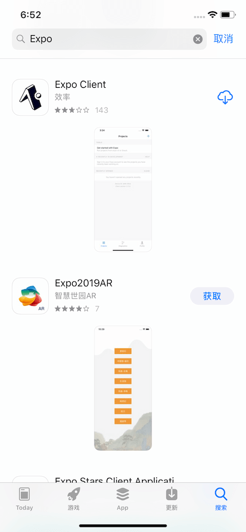
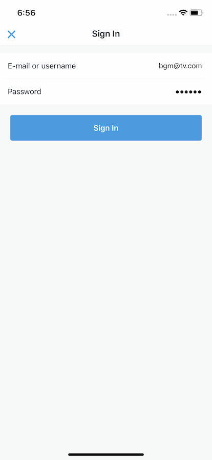

# iOS 用户使用测试客户端教程

因为不知道什么时候能过审, 我感觉就是审核人员吹毛求疵而已, 每次挑一些不是毛病的毛病拒绝, 而且还有误解, 有时还被看见上面的黄图又继续拒绝, 随缘吧.

---

#### 你需要有一台能上 app store 下载 app 的 iphone. ipad 应该也可以吧, 我还没适配样式, 应该很丑

#### 步骤 1

在 app store 下载这个软件

#### 步骤 2

下载完, 打开, 点蓝色的按钮

#### 步骤 3

账号: bgm@tv.com
密码: 123456

#### 步骤 4

登陆完成后如图, 之后每次进入这个软件都在这个页面, 点 bangumi 就可以打开
首次下载可能会卡住, 是因为网络问题

(补充: 这个还会自动同步最新的客户端, 假如某一次打开的时候在首屏卡住, 应该就是在后台自动下载新的更新了, 不是最新的版本的话, 打开软件放在一边过一会就自动变成最新的了)
