# Bangumi

> 一个基于`React-Native`的 [Bangumi](https://bgm.tv) 第三方客户端
>
> 安卓和 iOS 都做了兼容, 并最大限度保持一致, 目前已开发不少于 40 个页面, 持续开发中...
>
> 尽量做到每个版本再各个板块都有新功能或优化 (iOS 在审了)

---

#### Download

安卓 [[APK 下载]](https://github.com/czy0729/Bangumi/releases) | [[酷安下载]](https://www.coolapk.com/apk/235642)

苹果好难审, 短时间内都没办法通过, 会跟苹果做长久作战. 目前有方法可以试用, 不会太复杂 [[iOS 试用方法]](https://github.com/czy0729/Bangumi/blob/master/IOS-TEST.MD)

---

#### PowerBy

[[bangumi-api]](https://github.com/bangumi/api) 官方接口

[[bangumi-onair]](https://github.com/ekibun/bangumi_onair) 单集播放数据源

[[bangumi-data]](https://github.com/bangumi-data/bangumi-data) 番组数据索引

[[tinygrail.com]](https://tinygrail.com) 小圣杯接口

[[www.ningmoe.com]](https://www.ningmoe.com) 柠萌瞬间接口

[[app.anitama.net]](https://app.anitama.net) Anitama 接口

---

#### Versions

[CHANGELOG](https://github.com/czy0729/Bangumi/blob/master/CHANGELOG.MD)

---

#### Todos

v1.7.0 - 2019/11/29

—— 新功能 ——

- [x] [超展开] 可查看本地收藏盒缓存的小组帖子 (被删了的帖只要看过都能找回来)
- [x] [帖子] 本地收藏

—— 优化 ——

- [x] [条目] 继续优化请求策略, 使页面数据渲染更快
- [x] 优化 tabs 下划线 UI
- [x] hm.js@4.0

—— 修复 ——

- [x] [帖子 | 时间胶囊] 回复 | 吐槽的时候有可能失败, 原因为 cookie 过期等问题, 失败后不应清空回复内容

—— 小圣杯 ——

- [x] [小圣杯] 每日签到 / 分红 (节日奖励就不做了)
- [x] [小圣杯] 英灵殿列表
- [x] [小圣杯] 竞拍挂单列表
- [x] [小圣杯] 首页菜单内显示挂单数量 -
- [x] [小圣杯] 各页面列表二次排序追加按股息排序
- [x] [小圣杯] 前百首富分析 (入口在番市首富 Header 右上方)
- [x] [小圣杯] 资产分析可以隐藏低持仓价值(不满 100)的角色
- [x] [小圣杯] 资产分析的方格改为长按隐藏, 单击显示菜单
- [x] [小圣杯] 番市首富优化为股息榜
- [x] [小圣杯] 修复了首页总资产异常的问题

---

#### Features

- 小圣杯 (更适合移动端的交互)
- 素材使用了主站上能找到的 (b38 求大佬贡献)
- 番组进度管理
- 条目详情
- 人物详情 (最近出演、参与、出演)
- 时间胶囊
- 超展开 (各种人性化功能, 屏蔽, 回复, 留言倒序, 电波提醒)
- 小组
- 搜索 / 标签 / 排行版
- 个人时光机 (完整, 可筛选, 可排序)
- 好友 / 用户空间
- 热门 / 随便看看 /每日放送 / 历年年鉴

---

#### Page Preview

#### 进度

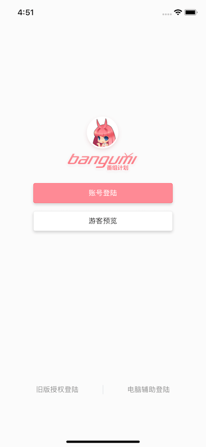  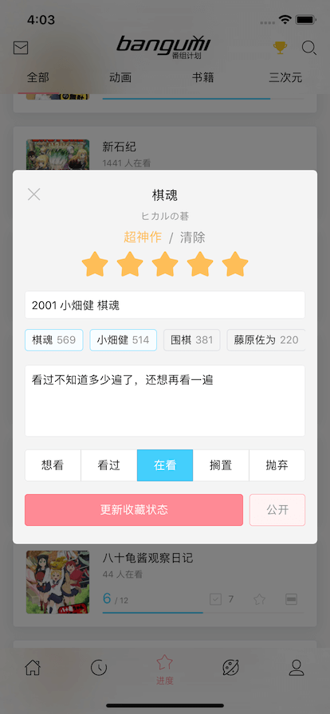 

#### 条目 / 人物

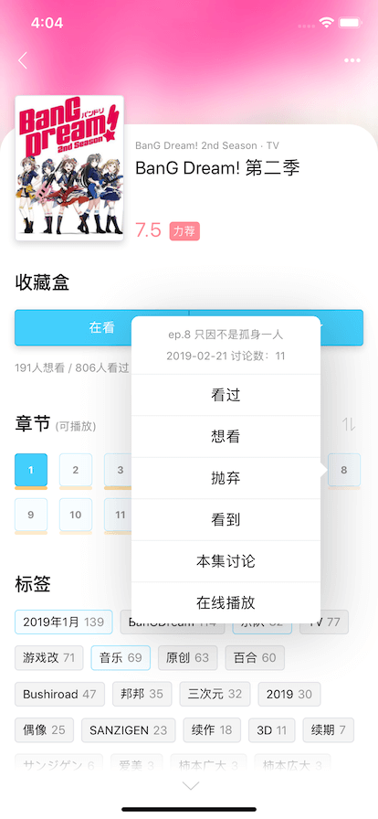 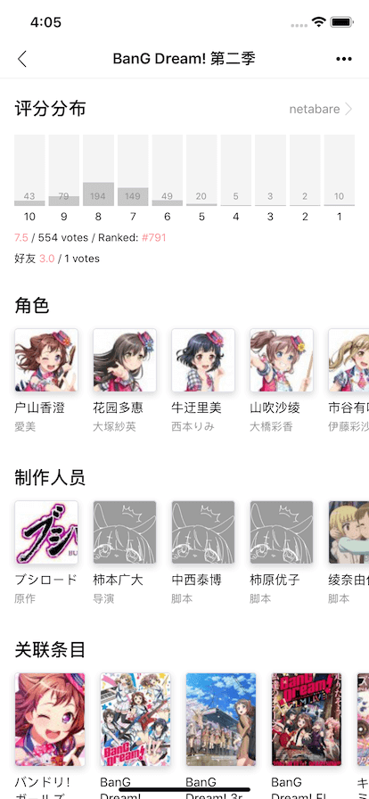  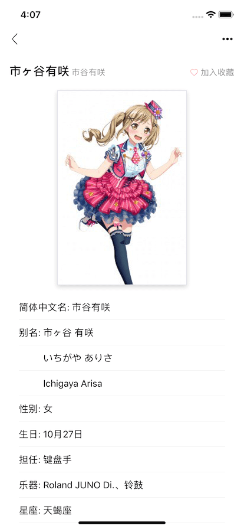

  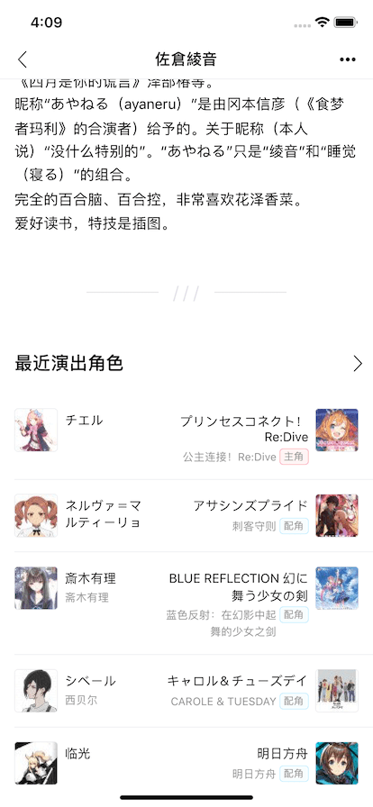 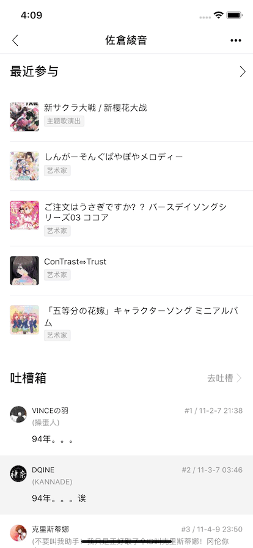

#### 发现

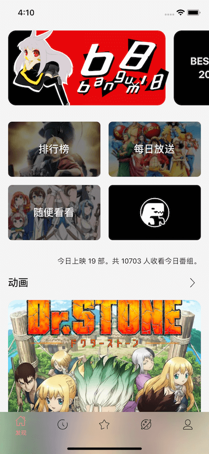   

#### 超展开

   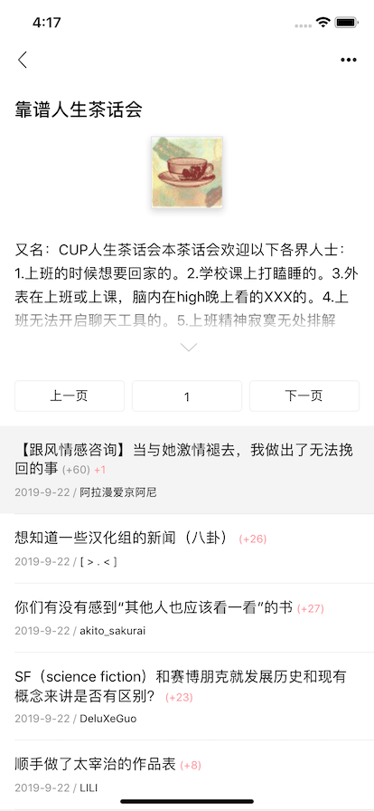

#### 时间胶囊

  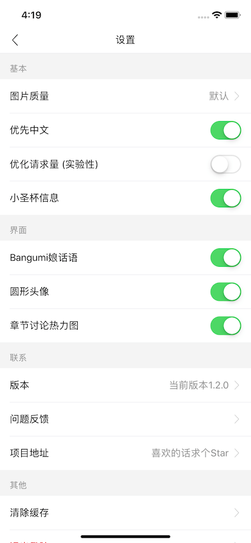

#### 索引

 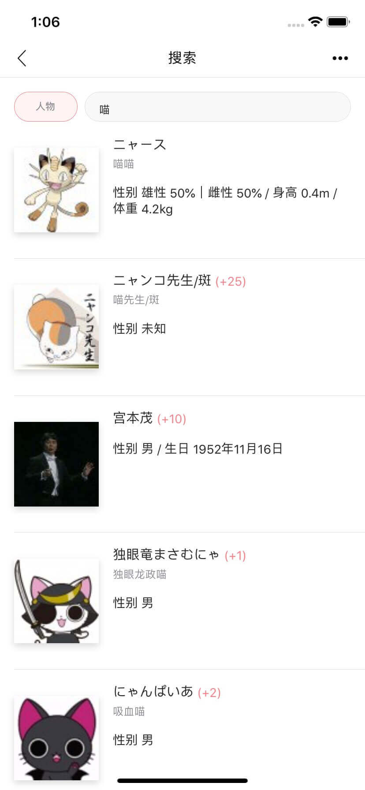  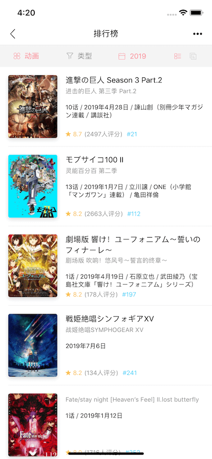

#### 空间 / 时光机

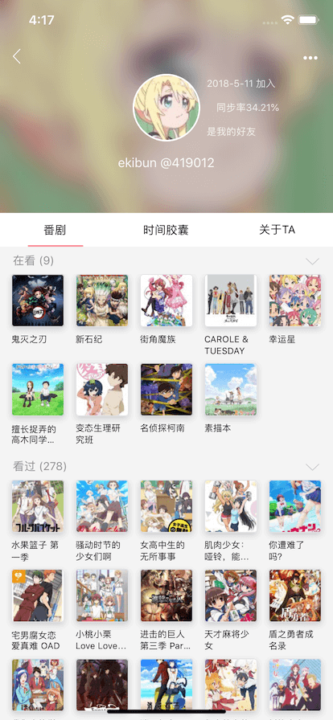   

#### 小圣杯 (新)

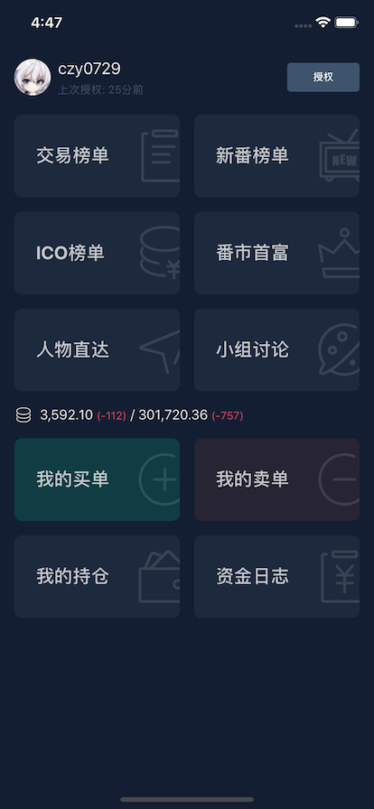 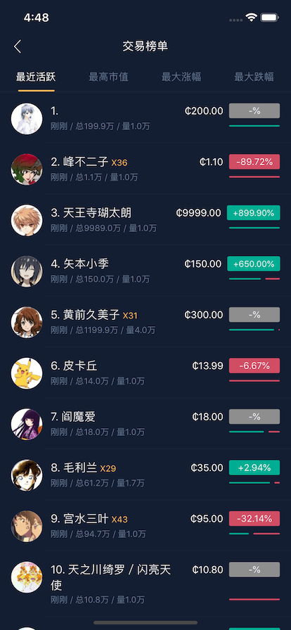 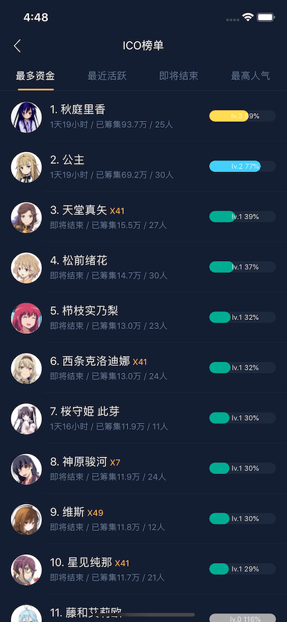 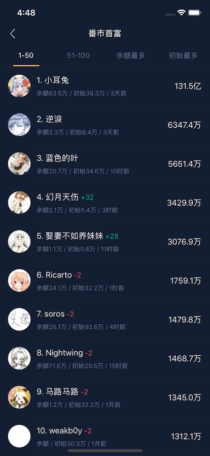
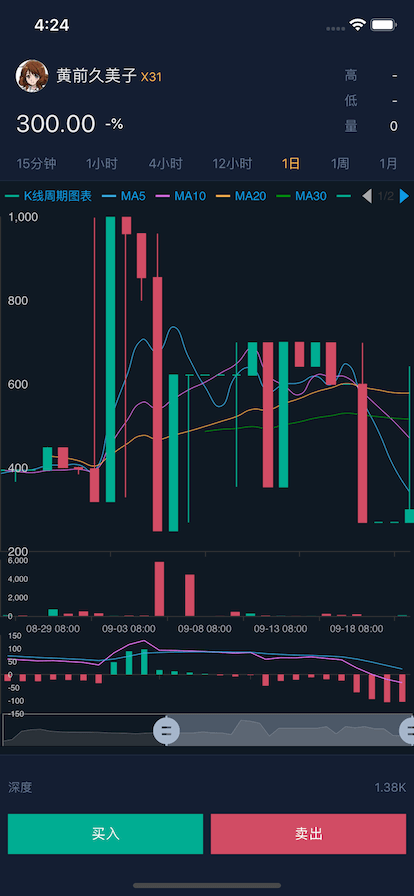 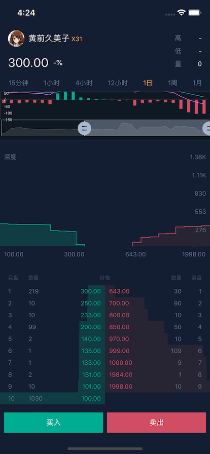 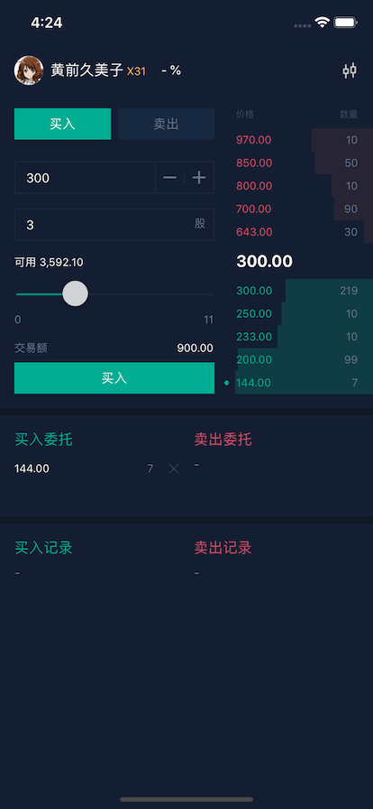 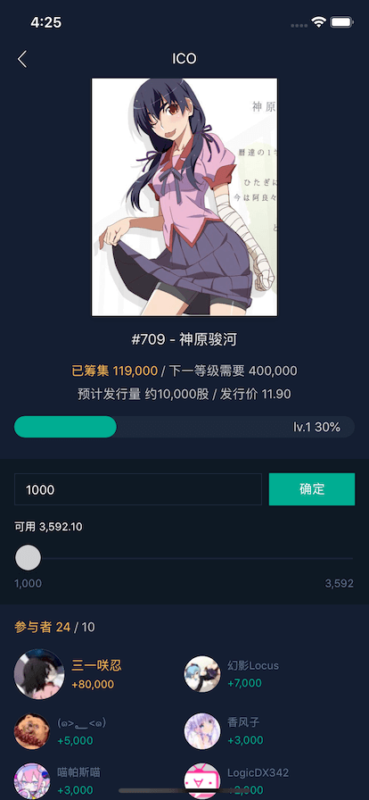
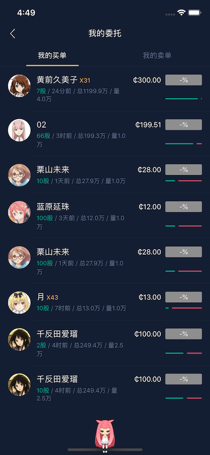 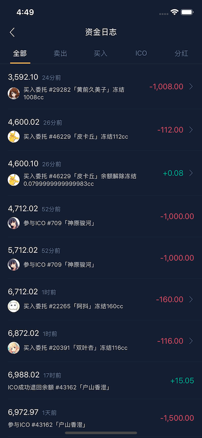

#### Demo

[若要在线预览, 请先安装 expo app](https://expo.io/tools)

[这个 expo app 貌似不用梯子](https://apkpure.com/expo/host.exp.exponent)


[expo 项目主页](https://expo.io/@a402731062/bangumi)

---

#### Getting Started

** 下载 **

注意, 某个依赖包在淘宝源里面 404, 要切换为 npm 官方源

```bash
npm config set registry https://registry.npmjs.org
```

国内环境, 首次下载包有可能会异常地慢

```bash
git clone https://github.com/czy0729/Bangumi
cd ./Bangumi
npm install // or yarn 因为后全面会替换掉node_modules的icon, 使用yarn可能会出现回退的现象
```

** 前置操作 **

自定义 Iconfont, 把 assets/iconfont/ 下的目录 `vector-icons` 和 node_modules/@expo/ 下的目录 `vector-icons` 合并 (注意是合并不是替换, 假如不行, 就手动把文件夹下面的 2 个文件, 找到对应的地方替换, 观察文件修改日期是不是变化了), 原理其实就是用自己的字体文件把原有的 AntDesign 字体文件替换掉, 之后引用 Icon.AntDesign .

** 启动 **

```bash
npm start // 之后点击在浏览器打开的Expo Developer Tools, 点击 Run on iOS simulator
```

window 用法不详, 也不清楚到底能不能运行, 可以查阅 [Expo](https://github.com/expo/expo) 官方文档. 可以选择同一局域网真机扫码调试, 需先下载 Expo App
