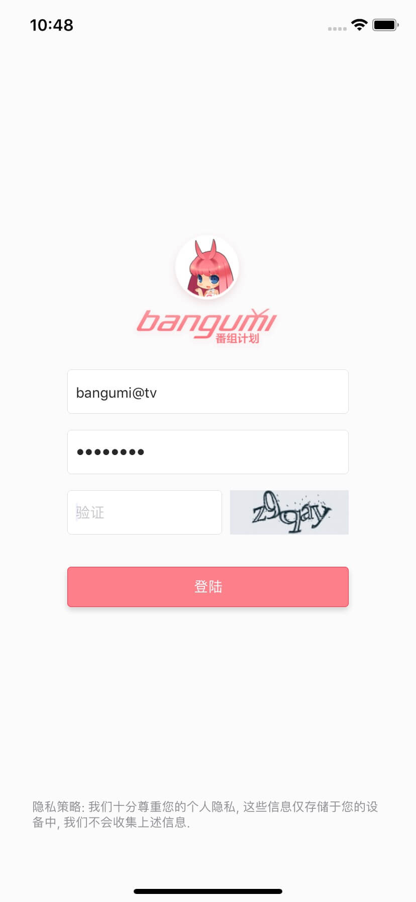
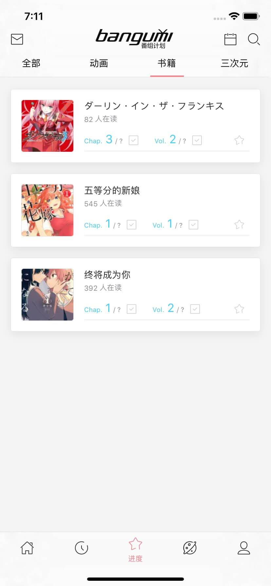
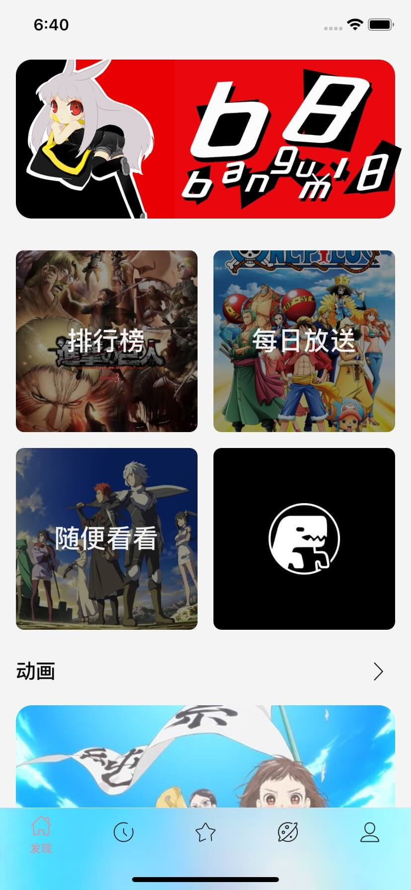
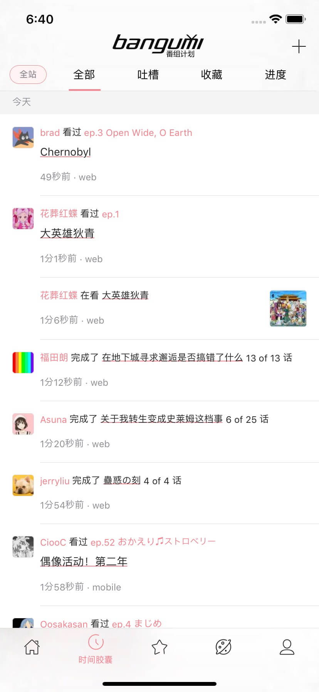
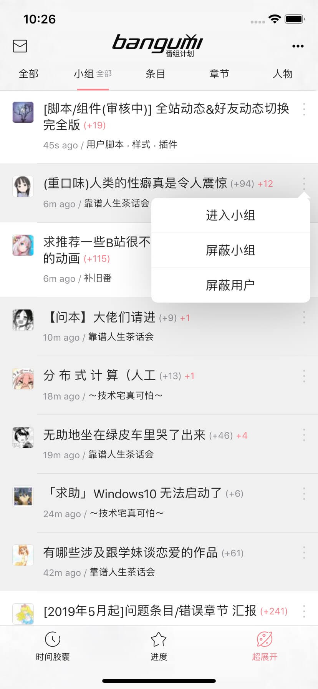
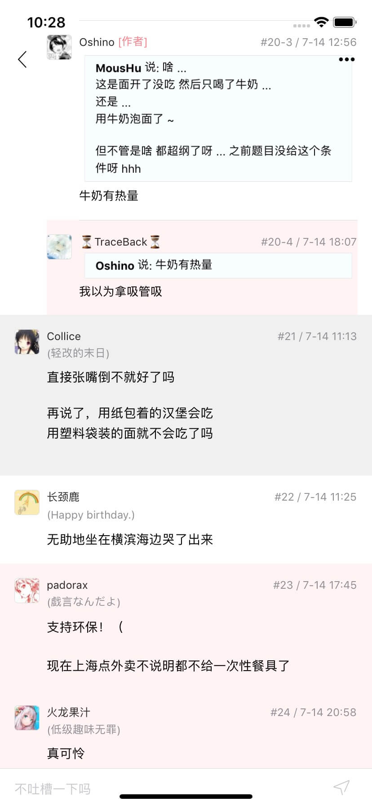
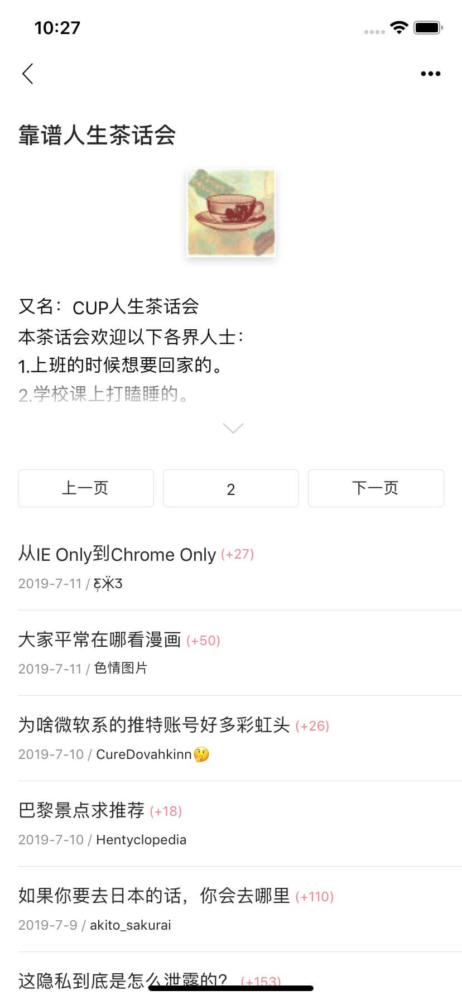
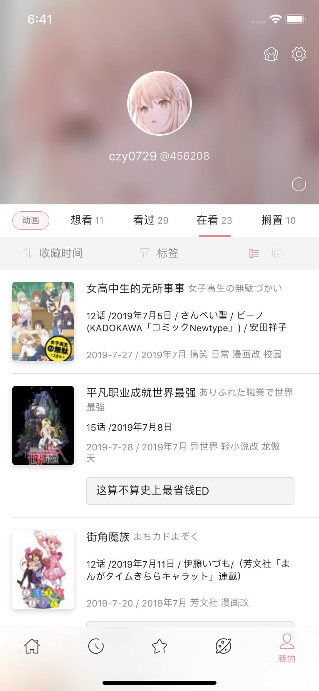
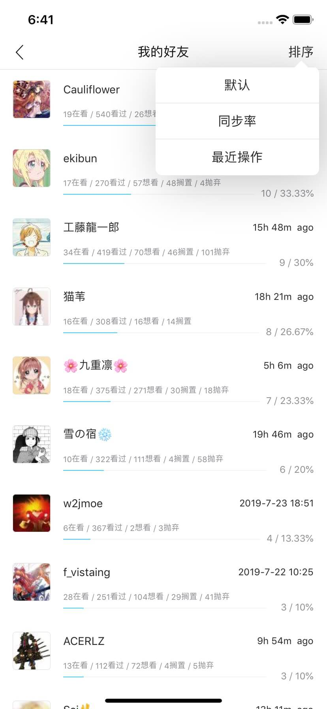
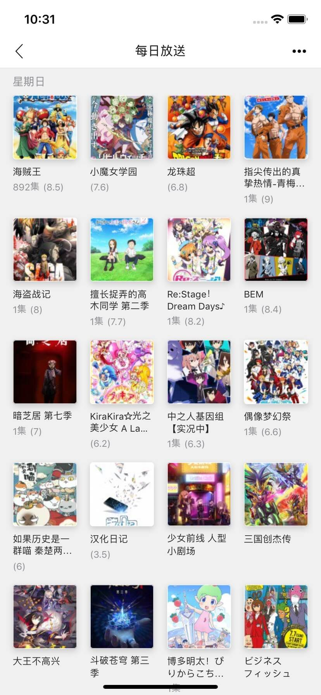

# Bangumi

> 一个基于`React-Native`的 [Bangumi](https://bangumi.tv) 第三方客户端
>
> 安卓和 iOS 都做了兼容, 并最大限度保持一致, 目前已开发不少于 30 个页面, 持续开发中...
>
> 尽量做到每个版本再各个板块都有新功能或优化, 预估 v1.0 左右上架 iOS 和 GooglePlay (开发者有点小贵, 100 和 25 美元, 先鸽一下...)

---

#### Download

[APK 下载地址](https://github.com/czy0729/Bangumi/releases)

---

#### Versions

v0.13.0 - 2019/08/27

—— 新功能 ——

- [x] [条目] 条目详情
- [x] [条目] 最近用户动态
- [x] [小组] 加入、退出小组
- [x] [人物] 收藏、取消收藏人物
- [x] [登陆] 电脑辅助登陆, 登陆问题太多, 有的人总是不能登录, 给了一个解决方案
- [x] [设置] 头像可以设置为圆形 (突然觉得圆形好看多了)

—— 小圣杯 ——

- [x] [设置] 设置开启小圣杯信息展示
- [x] [超展开] 添加人物股价信息
- [x] [小圣杯] 小圣杯概览页面 (暂时还没开发交易, 下个版本预定)

—— 修复 ——

- [x] 修复了 iOS 新版本不能登录的问题
- [x] 修复了安卓用户默认头像不能设置圆角的问题

—— 优化 ——

- [x] [条目] 留言加载时显示 loading
- [x] [设置] 对设置项进行了分组
- [x] 对大部分页面的图片默认质量进行了调高

[CHANGELOG](https://github.com/czy0729/Bangumi/blob/master/CHANGELOG.MD)

---

#### Todos

v0.14.0 - 2019/08/XX
—— 新功能 ——

- [ ] [帖子] 新增楼层滚动条
- [ ] [时间胶囊] 查看、回复吐槽
- [ ] [人物] 人物最近演出角色
- [ ] [人物] 人物最近参与
- [ ] [人物] 收藏了该人物的成员
- [ ] [发现] 标签
- [ ] [发现] 我收藏的人物
- [ ] [发现] 我关注的人物近况
- [ ] [电波提醒] 短信
- [ ] [电波提醒] 跳转到帖子自动到达目标楼层
- [ ] 适配安卓的 Adaptive Icons

—— 小圣杯 ——

- [ ] 相关功能

—— 优化 ——

- [ ] [超展开] 重写列表分析逻辑

---

#### Features

- 素材使用了主站上能找到的 (b38 求大佬贡献)
- 番组进度管理
- 条目详情 (支持 Ep 倒序)
- 人物详情 (最近出演、参与、出演)
- 时间胶囊
- 超展开 (各种人性化功能, 自定义屏蔽, 回复, 留言倒序, 电波提醒)
- 小组
- 搜索 / 标签
- 个人时光机, 其他用户空间 (完整, 可筛选, 可排序)
- 热门, 随便看看, 每日放送, 18 年鉴 (更沉浸, 内链接)

---

#### Page Preview

#### Home 进度

   

#### Subject 条目

  

 

#### Discovery 发现

   

#### Search 搜索 / 标签

   

#### Mono 人物

  

#### Timeline 时间胶囊

 

#### Rakuen 超展开

   

 

#### Zone 用户空间

 

#### User 个人时光机 / 好友

  

#### Other 排行榜 / 每日放送 / 电波提醒 / 设置

   

---

#### Demo

[若要在线预览, 请先安装 expo app](https://expo.io/tools)

[这个 expo app 貌似不用梯子](https://apkpure.com/expo/host.exp.exponent)


[expo 项目主页](https://expo.io/@a402731062/bangumi)

---

#### Getting Started

** 下载 **

注意, 某个依赖包在淘宝源里面 404, 要切换为 npm 官方源

```bash
npm config set registry https://registry.npmjs.org
```

国内环境, 首次下载包有可能会异常地慢

```bash
git clone https://github.com/czy0729/Bangumi
cd ./Bangumi
npm install // or yarn 因为后全面会替换掉node_modules的icon, 使用yarn可能会出现回退的现象
```

** 前置操作 **

自定义 Iconfont, 把 assets/iconfont/ 下的目录 `vector-icons` 和 node_modules/@expo/ 下的目录 `vector-icons` 合并 (注意是合并不是替换, 假如不行, 就手动把文件夹下面的 2 个文件, 找到对应的地方替换, 观察文件修改日期是不是变化了), 原理其实就是用自己的字体文件把原有的 AntDesign 字体文件替换掉, 之后引用 Icon.AntDesign .

** 启动 **

```bash
npm start // 之后点击在浏览器打开的Expo Developer Tools, 点击 Run on iOS simulator
```

window 用法不详, 也不清楚到底能不能运行, 可以查阅 [Expo](https://github.com/expo/expo) 官方文档. 可以选择同一局域网真机扫码调试, 需先下载 Expo App
