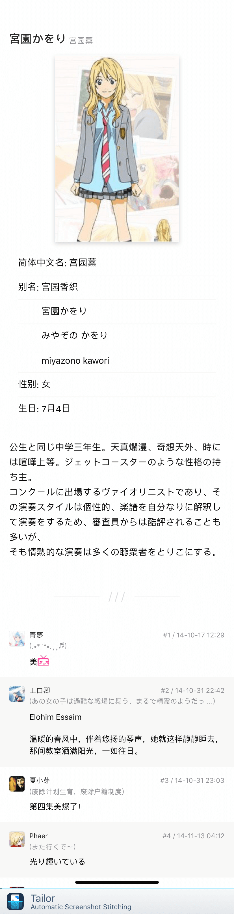
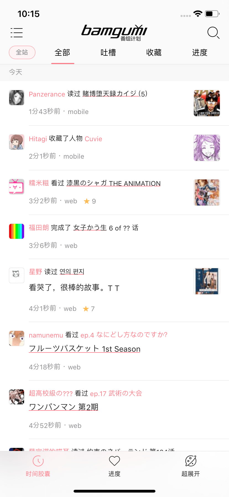
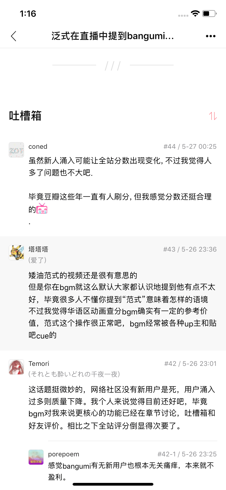

# Bangumi

> 这是一个基于`React-Native` 的 `Expo`写的 [Bangumi](https://bangumi.tv) 客户端
>
> 开发上对安卓和 iOS 都写了兼容, 开发环境是 iOS
>
> (安卓实机样式效果会有部分差异, 尽量保持一致, 功能持续开发中...)

#### Features

---

- 暂时没有图标和启动图 (bgm38 求大佬贡献)
- 番组进度管理
- 条目详情 (支持 Ep 倒序)
- 时间胶囊
- 超展开列表
- 帖子内容 (支持留言倒序)
- 搜索
- 其他用户空间
- 个人时光机 (完整的收藏记录)
- 每日放送
- 电波提醒
- 热门聚合 (todo)
- 每月番组索引 (todo)
- 排行榜 (?)
- 各板块直接回复 (todo)

#### Getting Started

---

** 下载 **

注意, 某个依赖包在淘宝源里面 404, 要切换为 npm 官方源

```bash
npm config set registry https://registry.npmjs.org
```

```bash
git clone https://github.com/czy0729/Bangumi
cd ./Bangumi
yarn // or npm i
```

** 前置操作 **

把 assets/iconfont/ 下的目录 vector-icons 替换掉 node_modules/@expo/ 下的 vector-icons

** 启动 **

```bash
npm start
Run on iOS simulator
```

window 用法不详, 可以查阅 [Expo](https://github.com/expo/expo) 官方文档

#### Page Preview

---

#### 登陆

  

#### 进度

  

#### 条目

  

#### 搜索

  

#### 人物

 

#### 时间胶囊

  

#### 超展开

  

#### 用户空间

 

#### 个人时光机

 

#### 每日放送, 电波提醒, 设置

  
