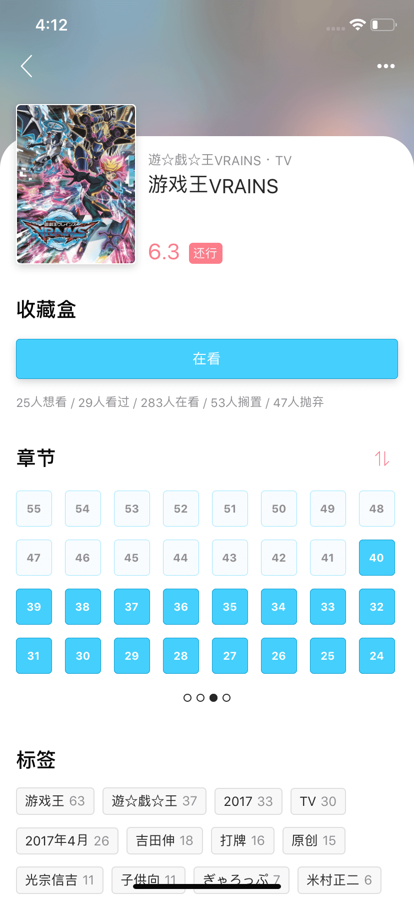
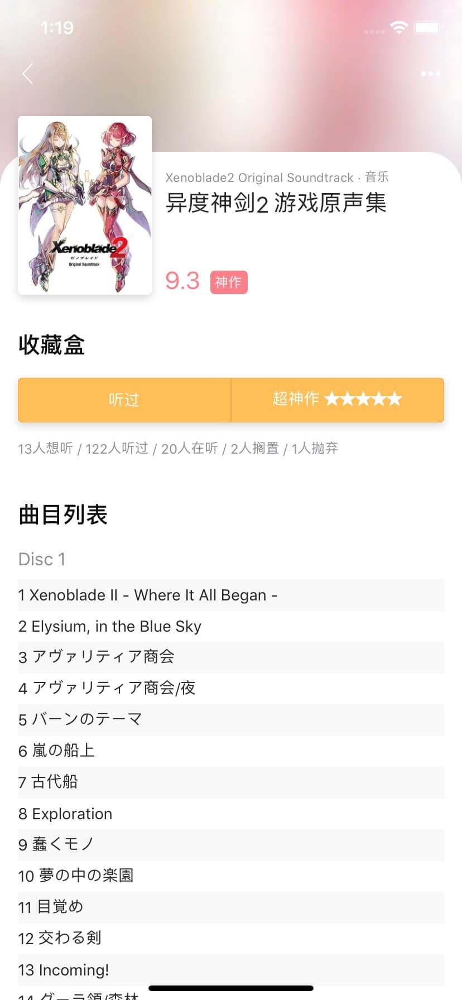
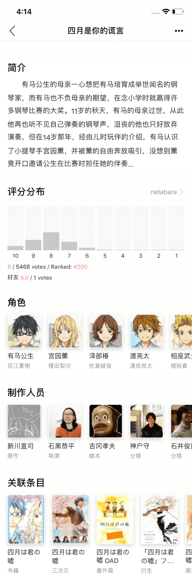
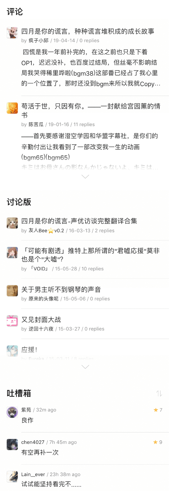
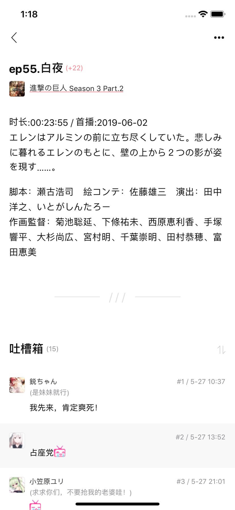

# Bangumi

> 这是一个基于`React-Native` 的 `Expo`写的 [Bangumi](https://bangumi.tv) 客户端
>
> 开发上对安卓和 iOS 都做到兼容, 开发环境是 iOS
>
> (安卓实机样式效果会有部分差异, 尽量保持一致, 功能持续开发中...)

---

#### Demo 在线演示

[expo 项目主页](https://expo.io/@a402731062/bangumi)


请先安装 [expo app](https://expo.io/tools)

---

#### Download 下载

[APK 下载地址](https://github.com/czy0729/Bangumi/releases)

---

#### Todo 下个版本预定功能

v0.6-alpha

- [x] [首页收藏] 书籍类显示加入 Vol、Chap
- [x] [条目] 书籍可以管理 Vol、Chap
- [ ] [条目] 书籍单行本列表
- [ ] [条目] 书籍喜欢 XXX 的会员大概会喜欢
- [x] [标签条目] 页面
- [ ] [超展开] 回复功能
- [ ] [章节] 回复功能
- [ ] [人物] 回复功能
- [ ] [用户] 同步率
- [ ] [用户] 关于 TA
- [ ] [每日放送] 添加播放时间
- [ ] [索引] 页面
- [ ] [目录] 页面
- [ ] 输入时键盘位置占位

---

#### Features 功能

- 素材使用了主站上能找到的 (bgm38 求大佬贡献)
- 番组进度管理
- 条目详情 (支持 Ep 倒序)
- 人物详情 (最近出演角色, 最近参与, 出演)
- 时间胶囊
- 超展开 (带电波提醒)
- 超展开帖子 (支持留言倒序, 整合章节内容)
- 搜索 / 标签
- 其他用户空间
- 个人时光机 (完整的, 可筛选标签, 可排序的收藏记录)
- 热门聚合, 每日放送
- 18 年鉴 (网页更沉浸, 内链接, 隐藏不关注内容, 调整条目和人物宽度使各机型铺满一行)
- 站内各板块直接回复 (#todo)
- 每月番组索引 (#todo)
- 各板块直接回复 (#todo)
- 排行榜 (?)

---

#### Getting Started 开始

** 下载 **

注意, 某个依赖包在淘宝源里面 404, 要切换为 npm 官方源

```bash
npm config set registry https://registry.npmjs.org
```

```bash
git clone https://github.com/czy0729/Bangumi
cd ./Bangumi
yarn // or npm i
```

** 前置操作 **

把 assets/iconfont/ 下的目录 vector-icons 替换掉 node_modules/@expo/ 下的 vector-icons

** 启动 **

```bash
npm start
Run on iOS simulator
```

window 用法不详, 可以查阅 [Expo](https://github.com/expo/expo) 官方文档

---

#### Page Preview 预览

#### Login 登陆

 

#### Home 进度

  

#### Subject 条目

  

 

#### Discovery 首页聚合 / 更沉浸的年鉴

  

#### Search 搜索 / 标签

   

#### Mono 人物

  

#### Timeline 时间胶囊

 

#### Rakuen 超展开

  

#### Zone 用户空间

 

#### User 个人时光机

 

#### Other 每日放送 / 电波提醒 / 设置

  
